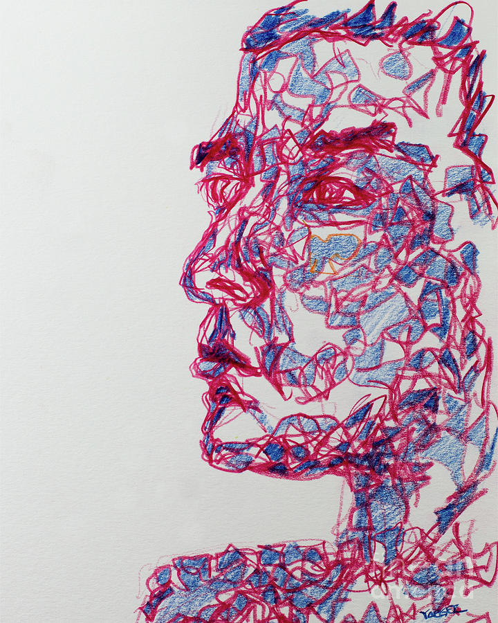

# Pen Plotter
Imagine a robot that can draw any image, with maximum precision, and moderate speed. The pen plotter machine accomplishes just this! Based upon a two axis system, the pen uses an arduino board to power its motors.

| **Engineer** | **School** | **Area of Interest** | **Grade** |
|:--:|:--:|:--:|:--:|
| Offir C | Mountain View High School | Computer Science | Incoming Junior

<!---**Replace the BlueStamp logo below with an image of yourself and your completed project. Follow the guide [here](https://tomcam.github.io/least-github-pages/adding-images-github-pages-site.html) if you need help.**

-->
# Results
Image from 2nd milestone (g-code was given to me):
 

Images from 3rd milestone (images from the web in which I made I my own g-code):

Image from modifcation:

# Final Milestone
<iframe width="560" height="315" src="https://www.youtube.com/embed/ERoyIy66yZs" title="YouTube video player" frameborder="0" allow="accelerometer; autoplay; clipboard-write; encrypted-media; gyroscope; picture-in-picture; web-share" allowfullscreen></iframe>

Overview:

For milestone 3, I desgined my project to be able to draw a custom image. I took an image from the web, made the g-code for it, and uploaded it to my grbl software.

Design:

Making the pen plotter draw any image is a multi step process.

1: Find an image, preferably not too complex and involving few colors.

2: Download inkscape and load your image. Turn on edge detection for the image and save it as a svg file.

3: Open jscut and load your svg file in. Set all measurements to mm, and create an operation. Select the engrave option, and download your file as g-code.

4: The g-code file in its current state, does not have the commands to lift the pen up and down. Thus, open an editor, I used notepad++, and replace ever instance of the retract command with M5 and M3S1000 of plunge
(Ctrl H to replace).

5: Then, simply enter the g-code into a grbl software.

Challenges:

Altough this process involved a lot of steps, I only faced one major issue. When I first ran the code, the pen did not lift up at all. This was because the g-code it produced did not contain the commands to lift the pen. I fixed this by uploading the code to notepad++ and replacing these commands with the proper line of code. This was step 4 of the process.

# Second Milestone
<iframe width="560" height="315" src="https://www.youtube.com/embed/IUFbGnLYD8A" title="YouTube video player" frameborder="0" allow="accelerometer; autoplay; clipboard-write; encrypted-media; gyroscope; picture-in-picture; web-share" allowfullscreen></iframe>

Overview:

For milestone 2, I implemented the software invovled with my project so that it can draw a given image. 

Design:

To build the software portion of my project, I used the candle software. The candle software uses g-code in order to direct the motors and lift the pen up. Unlike in the next milestone, the g-code was given to me, and so I just plugged the g-code into in the candle software and it worked!

Challenges:

While this process may seem simple, I did run into a few issues. At first, it draw a very messy and abstract version of my image. I was very puzzled as to why this happened, but then when I looked at the hardware I realized that the timing belt, the component responsible for moving the machine, was very loose. Turns out that I forgot to strap the timing belt to stop it from loosening out. In addition, I faced a small issue in which the pen plotter wasn't drawing the image in the middle of the page. This issue is very simple to fix as all what I needed to do was align the pen plotter a little to the left.   

# First Milestone
<iframe width="560" height="315" src="https://www.youtube.com/embed/OKzIARZuX_Q" title="YouTube video player" frameborder="0" allow="accelerometer; autoplay; clipboard-write; encrypted-media; gyroscope; picture-in-picture; web-share" allowfullscreen></iframe>

Overview:

For milestone 1, I completed all the hardware invovled with my pen plotter project. This meant that I built all the components, attached them together, and completed all the electrical wiring. 

Design:

To build this project, I first needed to construct the 5 main componets. This included building the frame and parts for the two motor components, building the component for the pen holder, constructing the piece opposite to the oen holder, just to keep the machine stable, and the center piece, which connects all the different components together. Afterwards, I attached all the different components together via the 4 steel rods. These steel rods pass through all the components and connect them. Then, I simply installed the timing belts, which is what the motors would be moving and consequently the machine too. Finally, I just had to install the electrical wirings for the motors, and steering gear, and attachem them to the arduino. 

Challenges:

I faced many issues when building this project. To begin, there were many screws and hex nuts which were placed in very obscure angles and were thus very hard to tighten. In addition, when I started this project, I failed to remove the stickers placed on the steel to protect it. This meant that I had to dismantle some of the compenents that I built in order to remove.

# Starter Project - Weevil Eye LED Bug
<iframe width="560" height="315" src="https://www.youtube.com/embed/RqrsvF4pcRo" title="YouTube video player" frameborder="0" allow="accelerometer; autoplay; clipboard-write; encrypted-media; gyroscope; picture-in-picture; web-share" allowfullscreen></iframe>

Design:

The premise of this project was to have two leds light up when it is dark. The light would be received by a photocell, which would generate electricity. If the generated electricity would be within a certain voltage, the transistor would switch on. Afterwards, there would be three resistors which would limit the current. Finaly, the current would light up the leds. I installed all these components via soldering.

Challenges:

While making this project, I encountered various issues. The first of these challenges came up, when I actually finished the project, but instead of the weevil eye only lighting up when it was dark, it always light up. The staff and I determined that the transistor was broken, and we needed to replace it. Thus, we tried to desolder the battery and transistor, but unfortunately, during the process we burned the photocell and had to re-start. The 2nd attempt was much more successful. I did encounter one issue though, in which I accidently install the photocell upside down. Fortunately, this was easily fixed as all I needed to do was de-solder it and re-attach it the right way up. Then I just attach the battery holder and it worked!

# Schematics

# Bill of Materials

| 2 PCS 8mm polished rods 450mm | $18.99 | <a href="https://www.amazon.com/Linear-Motion-inches-Hardened-Printer/dp/B08JGHHQCN/ref=asc_df_B08JGHHQCN/?tag=hyprod-20&linkCode=df0&hvadid=564821841578&hvpos=&hvnetw=g&hvrand=14700202961006999446&hvpone=&hvptwo=&hvqmt=&hvdev=c&hvdvcmdl=&hvlocint=&hvlocphy=9032171&hvtargid=pla-1362812653839&psc=1/"> Link </a> |
|:--:|:--:|:--:|
| 2 PCS 8mm polished rods 360mm | $9.95 | <a href="https://vxb.com/products/8mm-shaft-370mm-14-567-hardened-rod-linear-motion?variant=43580347646187&currency=USD&utm_medium=product_sync&utm_source=google&utm_content=sag_organic&utm_campaign=sag_organic&tm=tt&ap=gads&aaid=adaxXEtq4CiMg&gclid=EAIaIQobChMIypf0hIPn_wIV2R-tBh2nsQfpEAQYAiABEgJjuvD_BwE/"> Link </a> |
| Timing belt 1.5m | $10.99 | <a href="(https://www.amazon.com/Houkr-Printer-Timing-Closed-Perimeter/dp/B085NMDTDM/ref=asc_df_B085NMDTDM/?tag=hyprod-20&linkCode=df0&hvadid=459531815212&hvpos=&hvnetw=g&hvrand=15065551830845644261&hvpone=&hvptwo=&hvqmt=&hvdev=c&hvdvcmdl=&hvlocint=&hvlocphy=9032171&hvtargid=pla-914200992454&psc=1)/"> Link </a> |
| Linear Guide Assembly | $19.68 | <a href="https://www.amazon.com/CNCMANS-Bearing-Carriage-Printer-15-74inch/dp/B09QPHP21S/ref=asc_df_B09QPHP21S/?tag=hyprod-20&linkCode=df0&hvadid=658706434542&hvpos=&hvnetw=g&hvrand=6445786232967847568&hvpone=&hvptwo=&hvqmt=&hvdev=c&hvdvcmdl=&hvlocint=&hvlocphy=9032171&hvtargid=pla-2080939290445&psc=1&gclid=EAIaIQobChMIosu6uobn_wIVdQKtBh2mDQ4mEAQYBiABEgLQ_vD_BwE/"> Link </a> |
| 42 Stepper motor | $9.99 | <a href="https://www.amazon.com/Creativity-Stepper-Stepping-Extruder-Compatible/dp/B09L81TWYC/ref=asc_df_B09L81TWYC/?tag=hyprod-20&linkCode=df0&hvadid=652590917229&hvpos=&hvnetw=g&hvrand=7593275423695765603&hvpone=&hvptwo=&hvqmt=&hvdev=c&hvdvcmdl=&hvlocint=&hvlocphy=9032171&hvtargid=pla-2061832990449&psc=1&gclid=EAIaIQobChMIzLnBgofn_wIVGzKtBh0QpADtEAQYASABEgLdDPD_BwE"> Link </a> |
| Arduino controller | $26.99 | <a href="https://www.amazon.com/Control-Engraving-Machine-Motherboard-Corexy/dp/B09DWYRWP8"> Link </a> |
| MG90 steering gear | $8.49 | <a href="https://www.amazon.com/Replace-Helicopter-Airplane-Controls-Vehicle/dp/B09KXM5L7Z/ref=asc_df_B09KXM5L7Z/?tag=hyprod-20&linkCode=df0&hvadid=647294738363&hvpos=&hvnetw=g&hvrand=5834326162893392175&hvpone=&hvptwo=&hvqmt=&hvdev=c&hvdvcmdl=&hvlocint=&hvlocphy=9032171&hvtargid=pla-1747954003806&psc=1&gclid=EAIaIQobChMI_Pe17onn_wIVsB6tBh2x6A8XEAQYASABEgIGXPD_BwE"> Link </a> |
| Power Supply | $12.99 | <a href="https://www.amazon.com/COOLM-Adapter-100-240V-Security-Monitoring/dp/B07D5C745W/ref=asc_df_B07D5C745W/?tag=hyprod-20&linkCode=df0&hvadid=647221673261&hvpos=&hvnetw=g&hvrand=14295083690959649477&hvpone=&hvptwo=&hvqmt=&hvdev=c&hvdvcmdl=&hvlocint=&hvlocphy=9032171&hvtargid=pla-1948335663726&psc=1&gclid=EAIaIQobChMIob3o-Yrn_wIV5h-tBh0xOQG2EAQYASABEgJfz_D_BwE"> Link </a> |
